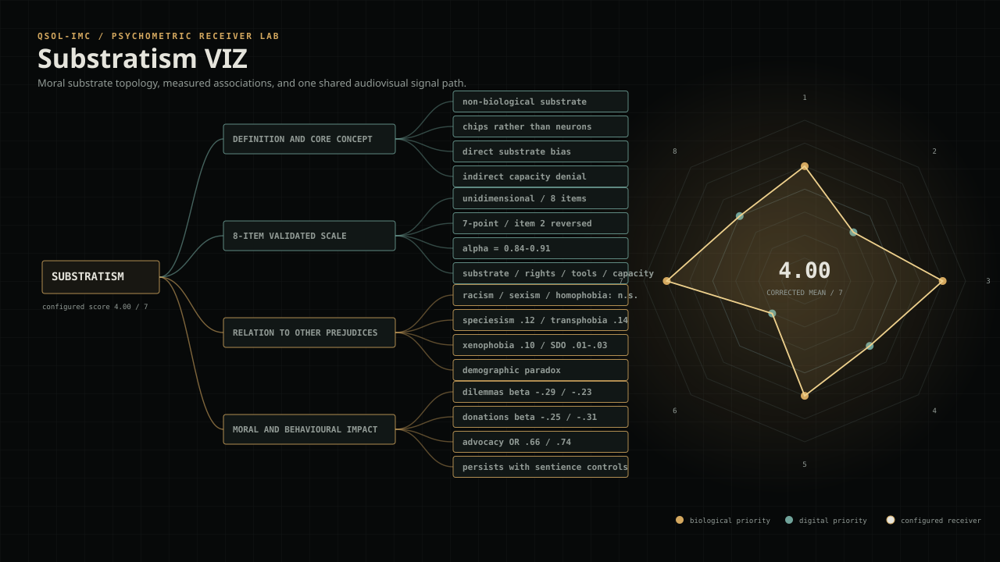
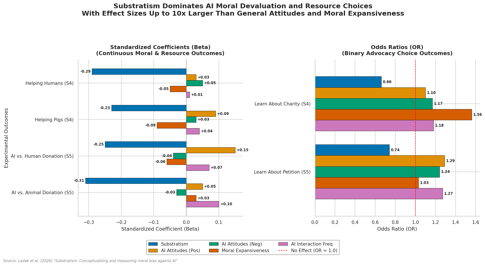

<!-- SPDX-License-Identifier: MIT -->
# Substratism VIZ

A dependency-free, offline visual and sonification laboratory for exploring the eight-item Substratism Scale and the moral, resource-allocation, and advocacy associations reported by Ladak et al. (2026).

<p align="center">
  <a href="https://qsolkcb.github.io/substratism/" title="Launch Substratism VIZ">
    
  </a>
</p>

<p align="center">
  <strong><a href="https://qsolkcb.github.io/substratism/">Launch the interactive moral substrate observatory →</a></strong>
</p>

GitHub READMEs cannot execute JavaScript, so the image above is a deterministic preview. Select it to use the full instrument on GitHub Pages, or run the same files locally with no internet connection.

## Start offline

Clone or download the repository and open `index.html` in a modern browser. There is no installation step, CDN, framework, analytics service, network client, or upload path.

For microphone analysis, serve the directory on local loopback so the browser can grant secure-context-compatible media permission:

```bash
python3 -m http.server 8000
```

Then open `http://localhost:8000`. Generated sonification, local-file analysis, PNG/JSON/WAV export, and most visual functions also work directly from `file://`.

## Four coupled receivers

| Receiver | Research fixture | Authored visual response |
|---|---|---|
| Concept map | Definition, validated scale, relation to other prejudices, measured outcomes | Four-branch topology rebuilt from the supplied research map |
| Scale lattice | Eight 1–7 responses with item 2 reverse-scored | Corrected radial coordinates and active-item traversal |
| Moral delta | Study 4–5 slopes, standardized coefficients, odds ratios, and sample means | Biological-to-digital outcome markers |
| Effect field | Substratism plus four comparison predictors across six outcomes | Signed coefficient vectors kept separate by β/OR metric |

These views are not separate animations. They receive the same corrected scale state, active item, outcome reconstruction, and local audio analyser bands.

## Audio controls the visual

The visual response can be driven by one of three browser-local sources:

1. a generated eight-step scale sonification;
2. microphone analysis;
3. analysis of a local audio file.

The generated receiver traverses the same eight items shown in the scale lattice and concept topology. The corrected scale mean controls tempo, biological/digital voice balance, filter frequency, and interval separation. RMS, bass, mid, and high-frequency energy then drive grid motion, glow, reach, displacement, node traversal, and field tension.

The mapping is deterministic for a given scale state, tuning, duration, and sample rate. It is an authored explanatory receiver—not an intrinsic sound of substratism and not evidence for any moral or ontological claim.

## Optional rendering

Live exploration requires no export. When an artifact is useful, the browser can create:

- a PNG snapshot of the current visual;
- canonical JSON containing the current responses, corrected score, receiver state, and reconstructed outcomes;
- a deterministic 48 kHz mono WAV of the generated scale sonification;
- an 8, 16, or 30 second WEBM canvas recording, optionally including the generated audio path.

All rendering happens locally in the browser.

## Exact scale implementation

Participants respond from 1 (strongly disagree) to 7 (strongly agree). Item 2—“Artificial intelligences should have rights”—is reverse-scored:

```text
corrected item 2 = 8 − response
substratism score = mean(all eight corrected items)
```

The workbook supplied with this project groups items 1, 3, 5, and 7 as substrate-explicit. Items 2, 4, 6, and 8 capture rights/treatment, functional limits, and capacity denial. The application exposes both four-item channel means without presenting them as independently validated subscales; the paper reports a single unidimensional construct.

| Fixture | Published value |
|---|---:|
| Scale items | 8 |
| Response range | 1–7 |
| Reverse-scored items | 1 (item 2) |
| Standardized factor loadings in final Study 1 scale | 0.69–0.84 |
| Cronbach’s α across studies | 0.84–0.91 |
| Preregistered studies | 5 |
| Total participants | 2,129 |

## Outcome reconstruction

The moral-delta receiver is centred on each study’s published sample mean and outcome mean.

For continuous outcomes:

```text
receiver value = published outcome mean + b × (configured score − study score mean)
```

For binary advocacy outcomes:

```text
logit(receiver probability)
  = logit(published outcome proportion)
  + ln(OR) × (configured score − study score mean)
```

This makes the coefficient direction and approximate scale explorable. It does **not** recreate the authors’ full regression models, confidence intervals, covariate settings, or individual-level predictions.

## Published coefficient reference

The repository’s original regression chart is retained as a static reference:



The application centralizes the plotted values in `js/substratism-core.js` and tests representative fixtures, including β = −0.31 for AI-versus-animal donations, OR = 0.66 for the Study 4 charity link, and OR = 0.74 for the Study 5 petition link.

## Claim boundary

| Layer | Status |
|---|---|
| Eight scale statements and reverse-scoring rule | Published research fixture |
| Reliability, sample sizes, study means, β values, slopes, and odds ratios | Published research fixtures transcribed from the paper and project chart |
| Four concept-map branches and item classifications | Project-supplied explanatory organization |
| Corrected overall mean | Exact implementation of the reported scale rule |
| Explicit and treatment/capacity channel means | Descriptive project receivers, not validated subscales |
| Outcome values shown for a configured score | Transparent reconstruction, not the authors’ fitted prediction |
| Colours, topology, motion, synthesis, tuning, and audiovisual coupling | Authored observation receivers |

The paper defines substratism descriptively: different moral consideration or treatment based on non-biological substrate. It does not itself settle whether substrate differences are morally justified. This application is educational, not diagnostic.

## Project structure

```text
index.html                         Offline application shell
style.css                          Responsive industrial visual system
js/substratism-core.js             Scale, scoring, coefficient, and outcome fixtures
js/sonification.js                 Generated, microphone, file, analyser, and WAV paths
js/visuals.js                      Concept map, lattice, outcome, and coefficient receivers
js/app.js                          Interaction, inspection, state, and render orchestration
assets/substratism-viz.svg         Deterministic README preview
8-Item Substratism Scale…xlsx      Project-supplied classified scale table
Screenshot From 2026-07-26…png     Original project-supplied concept map
scripts/render_preview.py          Standard-library preview renderer
tests/                             Scale, coefficient, determinism, and offline checks
.github/workflows/pages.yml        Static GitHub Pages deployment
```

The research paper, executive summary, supplied workbook, static coefficient chart, and its chart-generation script remain in the repository as source material.

## Verification

Node.js is used only for development checks:

```bash
npm test
```

The suite checks the eight-item instrument, reverse scoring, channel arithmetic, published coefficient fixtures, outcome reconstruction, deterministic WAV bytes, offline packaging, accessibility markers, render paths, and GitHub Pages workflow.

Regenerate the README preview with:

```bash
python3 scripts/render_preview.py
```

## Sources

- Ali Ladak, Janet V. T. Pauketat, Jacy Reese Anthis, Steve Loughnan, and Matti Wilks, “[Substratism: Conceptualizing and measuring moral bias against AI](https://doi.org/10.1016/j.chb.2026.109120),” *Computers in Human Behavior* 185 (2026), 109120.
- [Open data, code, and experimental materials](https://osf.io/rb4jw/)
- [Study preregistrations](https://researchbox.org/2150)

## Licence

MIT License. Copyright 2026 QSOL-IMC / Quantum-Sourced Optimization-Logic Integrated Meme Company.
